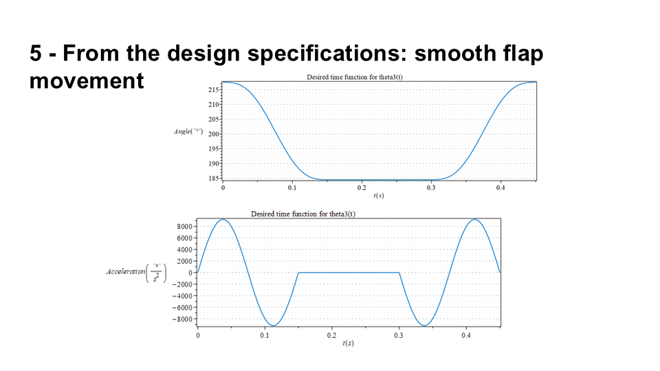
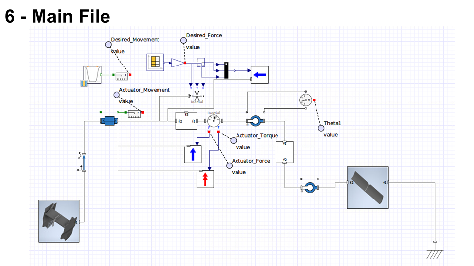

# DRS_analysis

The goal of this project was to study three different actuation mechanisms for the Drag Reduction System (DRS) of a F1 racing car

In particular, the analyzed mechanisms were
-   Pod pull mechanism
-   Pod push mechanism
-   Pods and rocker mechanism

The analysis has been conducted with the help of **Maple** and **Matlab**.

The different mechanisms have been studied from both kinematic and dynamic points of view. The best one (Pod pull) has been then kinematically and dynamically optimized.

The obtained Differential Algebraic Equations derived from dynamics have been then exported to Matlab for a further analysis with different integration methods
-   [lib](/lib/) and [toolbox](/toolbox/) folders contain some customized libraries for the Maple analysis
-   [maplesim](/maplesim/) folder contains the files for the hydraulic simulation
-   [matlab](/matlab/) folder contains all the Matlab files used to study the exported DAEs
-   [inventor](/inventor/) folder contains the CAD files used to estimate the flap dimensions

## Full Presentation

 

 

 

 

 

 

 

 

 

 

 

 

 

 

 

 

 

 

 

 

 

 

 

 

 

 

 

 

 

 

 

 

 

 

 

 

 

 

 

 

 

 

 

 

 

 

 

 

 

 

 

 

 

 

 

 

 

 

 

